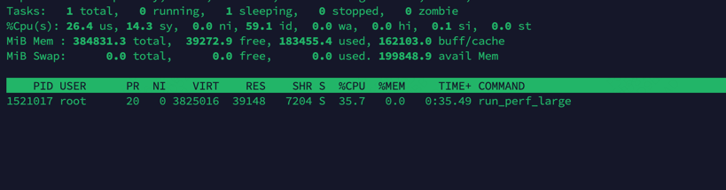

## 性能对比分析
每个并发量级的数据总量都为 1 亿条数据，每个 stream load 5w 条数据
| 并发数 | 总耗时 | 数据量GB | 记录数/秒 | MB/秒  | 成功率  | 扩展效率 |
|--------|--------|----------|-----------|--------|---------|----------|
| 1      | 5m29s  | 10.362   | 304.2K    | 32.28  | 100.0%  | 100.0%   |
| 4      | 1m26s  | 10.362   | 1.2M      | 123.04 | 100.0%  | 95.3%    |
| 8      | 46s    | 10.362   | 2.2M      | 232.53 | 100.0%  | 90.0%    |
| 12     | 33s    | 10.362   | 3.0M      | 322.73 | 100.0%  | 83.3%    |

## 性能提升分析 
基准性能 (并发=1):
📊 304.2K 条/秒 | 32.28 MB/秒 | 耗时: 5m29s

各并发级别对比基准的提升:
并发 4: 🚀 3.81x 吞吐量 | ⚡ 3.81x 带宽 | ⏱️  3.81x 时间缩短
并发 8: 🚀 7.20x 吞吐量 | ⚡ 7.20x 带宽 | ⏱️  7.20x 时间缩短
并发 12: 🚀 10.00x 吞吐量 | ⚡ 10.00x 带宽 | ⏱️  10.00x 时间缩短

# 扩展性分析
理想扩展 vs 实际扩展:
并发 1: 基准性能
并发 4: 🟢 优秀扩展 (效率: 95.3%)

并发 8: 🟢 优秀扩展 (效率: 90.0%)

并发 12: 🟢 优秀扩展 (效率: 83.3%)

并发 1: 成功率 100.00%, 吞吐量 304.2K 条/秒

并发 4: 成功率 100.00%, 吞吐量 1.2M 条/秒

并发 8: 成功率 100.00%, 吞吐量 2.2M 条/秒

并发 12: 成功率 100.00%, 吞吐量 3.0M 条/秒

1并发

12并发
